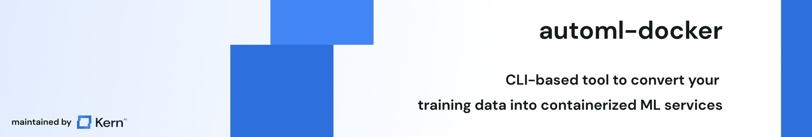

# 🐳 automl-docker
CLI-based framework to automatically build ML models from training data into a servable Docker container.

## Prerequisites
This library uses [spaCy](https://github.com/explosion/spaCy) for tokenization; to apply it. During the creation procedure, you'll be asked to download specific language models.

## Installation
You can set up this library via either running `$ pip install automl-docker`, or via cloning this repository and running `$ pip install -r requirements.txt` in your repository.

A sample installation would be:

```
$ conda create --name automl-docker python=3.9
$ conda activate automl-docker
$ pip install automl-docker
```

## Usage
Once you installed the package, you can apply the application via running `$ automl-docker`, which will launch a dialogue in your CLI guiding you through the automl process:

```
Welcome to 🐳 automl-docker! Please enter the type of task you want to do (currently supporting [classification, named-entity-recognition])

> classification
```

```
Great, we'll help you set up your classification. Where do you have your training data stored?

> path/to/files/training_data.json
```

```
Please enter the language of your data in ISO2 code

> EN
```

```
For english data, you need to have the en_core_web_sm data loaded; if you haven't done so yet, please run "$python -m spacy download en_core_web_sm" and confirm with "y" afterward

> y
```

```
We're now loading the models to embed your data. Please enter the configuration string (suggestion: "distilbert-base-uncased")

> distilbert-base-uncased
```

```
Cool, we're ready to train 🚀
Now is the time to grab a coffee as your model is training on the data. You can see the training progress below.

76%|████████████████████████        | 7568/10000 [00:33<00:10, 229.00it/s]
```

```
We've trained and validated your model.

            Precision   Recall  F-Score
Positive    90.0%       90.0%   90.0%
Neutral     90.0%       90.0%   90.0%
Negative    90.0%       90.0%   90.0%

The Dockerfile to run this service has been stored to "training_data-distilbert-base-uncased.Dockerfile". You can find a detailed report of the performance under "training_data-distilbert-base-uncased.xlsx".
```

Finally, you can build an image from the Dockerfile via running `$ docker build -t my_app`, and then launch the service by `$ docker run -dp 3000:3000 my_app`. You can see the swagger documentation on `localhost:3000/docs` - congrats, you just build your first ML service ✋

## Configuration strings
We're making use of large, pre-trained transformers pulled from [🤗 Hugging Face](https://huggingface.co/). If you're not sure which string to use, here are some high-level recommendations:
- Multiple languages: `bert-base-multilingual-uncased`
- English language + generic domain: `distilbert-base-uncased`
- German language: `bert-base-german-uncased`

You can find plenty of other (domain-specific) language models on Hugging Face, so give it a try.

## Roadmap
- [ ] Build basic CLI to capture the data
- [ ] Build mappings for language data (e.g. `EN` -> ask for `en_core_web_sm` AND recommend using `distilbert-base-uncased`)
- [ ] Implement AutoML for classification (training, validation and storage of model)
- [ ] Implement AutoML for ner (training, validation and storage of model)
- [ ] Wrap instructions for build in a Dockerfile
- [ ] Add sample projects (twitter sentiment analysis, intent classification and some named entity recognition) and publish them in some posts
- [ ] Publish the repository and set up new roadmap

If you want to have something added, feel free to open an [issue](https://github.com/code-kern-ai/automl-docker/issues).

## Contributing
Contributions are what make the open source community such an amazing place to learn, inspire, and create. Any contributions you make are **greatly appreciated**.

If you have a suggestion that would make this better, please fork the repo and create a pull request. You can also simply open an issue with the tag "enhancement".
Don't forget to give the project a star! Thanks again!

1. Fork the Project
2. Create your Feature Branch (`git checkout -b feature/AmazingFeature`)
3. Commit your Changes (`git commit -m 'Add some AmazingFeature'`)
4. Push to the Branch (`git push origin feature/AmazingFeature`)
5. Open a Pull Request

And please don't forget to leave a ⭐ if you like the work! 

## License
Distributed under the Apache 2.0 License. See LICENSE.txt for more information.

## Contact
This library is developed and maintained by [kern.ai](https://github.com/code-kern-ai). If you want to provide us with feedback or have some questions, don't hesitate to contact us. We're super happy to help ✌️
